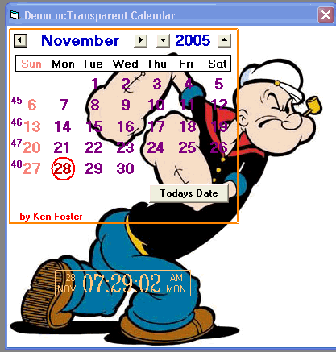



## ucTransparent Calendar

### Description

This is a transparent calendar usercontrol. Place on a form with a picture in the background for great looking results.I don't care if you vote for it or not,just hope you can use it. I've added a few new features plus my transp clock control and fixed a couple of bugs.
 
### More Info
 

             |
---                |---
**Submitted On**   |2005-11-28 07:29:54
**By**             |[Kenneth Foster](https://github.com/Planet-Source-Code/PSCIndex/blob/master/ByAuthor/kenneth-foster.md)
**Level**          |Intermediate
**User Rating**    |4.6 (23 globes from 5 users)
**Compatibility**  |VB 6\.0
**Category**       |[Custom Controls/ Forms/  Menus](https://github.com/Planet-Source-Code/PSCIndex/blob/master/ByCategory/custom-controls-forms-menus__1-4.md)
**World**          |[Visual Basic](https://github.com/Planet-Source-Code/PSCIndex/blob/master/ByWorld/visual-basic.md)
**Archive File**   |[ucTranspar19517111282005\.zip](https://github.com/Planet-Source-Code/kenneth-foster-uctransparent-calendar__1-63387/archive/master.zip)

